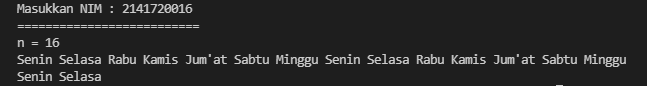

# Lapooran Praktikum Pertemuan 1

## Output
Hasil running program :
1. Pemilihan
    
2. Perulangan
    
3. Array
    
4. Fungsi
    
5. Tugas
    
    a. Program Smile Laundry
        
    b. Program Hitung
        