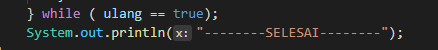
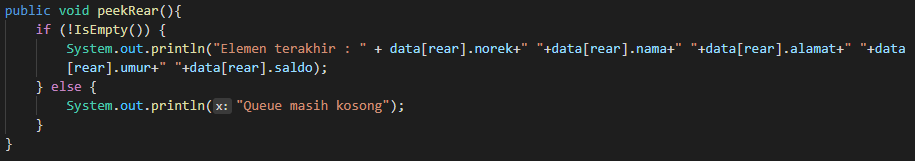
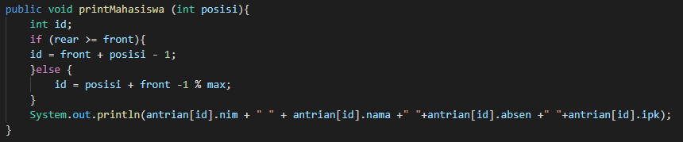
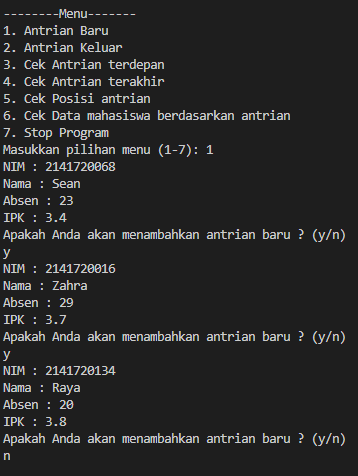

# Laporan Praktikum Pertemuan 10

Zahra Annisa Wahono 1F - TI / 29

## Jawaban Pertanyaan

### **Praktikum 1**

1. Pada konstruktor, mengapa nilai awal atribut front dan rear bernilai -1, sementara atribut size bernilai 0?

    **Jawab:** Karena saat awal dibuat dan antrian masih kosong, front dan rearnya masih di luar array yang mana diwakili dengan indeks -1 (tidak dalam array). Size menunjukkan jumlah antrian yang ada, pada awal pembuatan antrian masih 0.

2. Pada method Enqueue, jelaskan maksud dan kegunaan dari potongan kode berikut!

            if(rear == max - 1){
                rear = 0;

    **Jawab:** Jika rear telah memenuhi indeks terakhir dari array, maka rear selanjutnya akan berapa pada indeks ke 0

3. Pada method Dequeue, jelaskan maksud dan kegunaan dari potongan kode berikut!

            if(front == max - 1){
                front = 0;

    **Jawab:** Jika front telah memenuhi indeks terakhir dari array, maka rear selanjutnya akan berapa pada indeks ke 0

4. Pada method print, mengapa pada proses perulangan variabel i tidak dimulai dari 0 (int i=0), melainkan int i=front?

    **Jawab:** Karena pada i = 0 belum tentu merupakan antrian pertama atau bahkan kosong

5. Perhatikan kembali method print, jelaskan maksud dari potongan kode berikut!

            i = i + 1 % max;

    **Jawab:** Itu merupakan increment dari i agar pertambahan i selaras dengan kapasitas maksimal array

6. Tunjukkan potongan kode program yang merupakan queue overflow!

    **Jawab:** 

7. Lakukan modifikasi program sehingga pada saat terjadi
queue overflow dan queue underflow, program dihentikan!

   **Jawab:** 

   Kode Modifikasi

   
   

   Output

   
   

### **Praktikum 2**

1. Pada class QueueMain, jelaskan fungsi IF pada potongan kode program berikut!

            if(!"".equals(data.norek) && !"".equals(data.nama ) && !"".equals(data.alamat) && data.umur != 0 && data.saldo != 0){
                        System.out.println("Antrian yang keluar : "+data.norek+" "+data.nama+" "+data.alamat+" "+data.umur+" "+data.saldo);
                        break;
                    }

    **Jawab:** Untuk memastikan bahwa data yang akan dikeluarkan pada atribut norek, nama, dan alamat tidak kosong serta atribut umur dan saldonya tidak 0, maka akan di print pemberitahuan bahwa data tersebut telah keluar sedangkan jika salah satu syarat tersebut tidak terpenuhi maka pemberitahuan data keluar tidak akan di print

2. Lakukan modifikasi program dengan menambahkan method baru bernama peekRear pada class Queue yang digunakan untuk mengecek antrian yang berada di posisi belakang! Tambahkan pula daftar menu 5. Cek Antrian paling belakang pada class QueueMain sehingga method peekRear dapat dipanggil!

    **Jawab:** 

##  **TUGAS**
1. **Kode Modifikasi**

    
    

    **Output**

    
    

2. **Kode**

    Class mahasiswa

    

    Class queue

    
    
    
    
    

    Class queueMahasiswaMain

    
    

    **Output**

    
    
    
    

            