#  Laporan Praktikum Pertemuan 11

Zahra Annisa Wahono 1F-TI / 29

## Jawaban Pertanyaan

### **Praktikum Pembuatan Single Linked List**

1. Mengapa hasil compile kode program di baris pertama menghasilkan “Linked List Kosong”?

    **Jawab:** Karena pemanggilan method print saat linked list berlum di isikan elemen (kosong) 

2. Pada step 10, jelaskan kegunaan kode berikut

            ndInput.next = temp.next;
                temp.next = ndInput;

    **Jawab:** ketika key(setelah) sama dengan temp, maka linked list baru akan ditambahkan setelah temp atau key dan kemudian linked list yang sebelumnya ada di belakang temp akan dipindah menjadi dibelakang linked list yang baru ditambahkan tadi

3. Perhatikan class SingleLinkedList, pada method insertAt Jelaskan kegunaan kode berikut
    
            if(temp.next.next==null) tail = temp.next;

    **Jawab:** Jika setelah temp.next tidak ada lagi linked list (temp berada di 2 terakhir) maka tail berisi temp.next

### **Modifikasi Elemen pada Single Linked List**

1. Mengapa digunakan keyword break pada fungsi remove? Jelaskan!

    **Jawab:** agar perulangan berhenti setelah data yang akan dihapus ditemukan

2. Jelaskan kegunaan kode dibawah pada method remove

        else if (temp.next.data == key){
         temp.next = temp.next.next;

    **Jawab:** Ketika key yang dicari berada ditengah linked list dan tidak di head maka pointer akan menunjuk linked list selanjutnya 

3. Apa saja nilai kembalian yang dapat dikembalikan pada method indexOf? Jelaskan maksud masing-masing kembalian tersebut!

    **Jawab:** Terdapat kembalian -1 dan indeks data yang dicari, kembalian -1 menunjukkan bahwa data yang dicari tidak ditemukan pada linked list

## **Tugas**

1. method insertBefore

    Kode :

    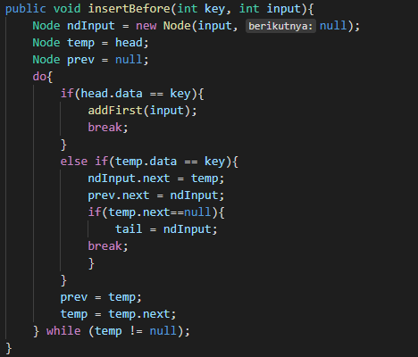

    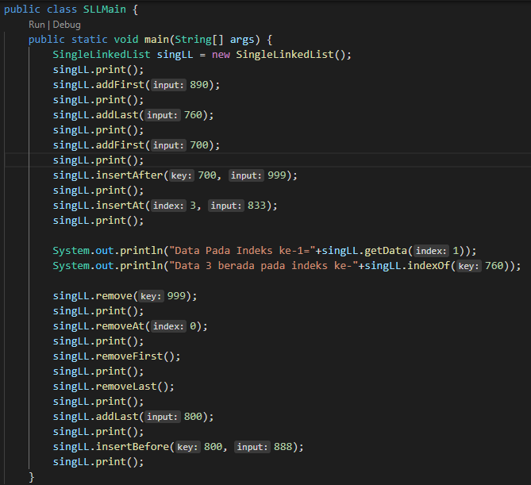

    Output :
    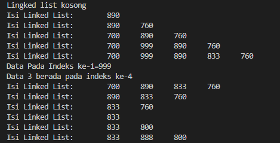

2.  Kode :

    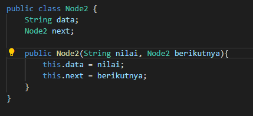

    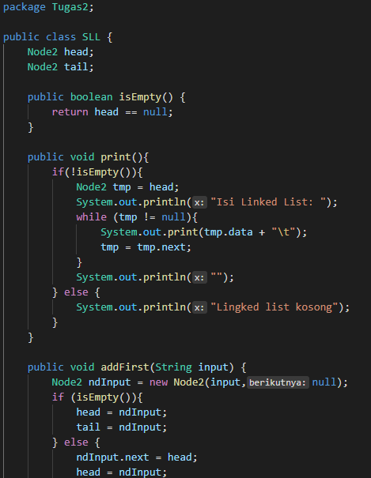

    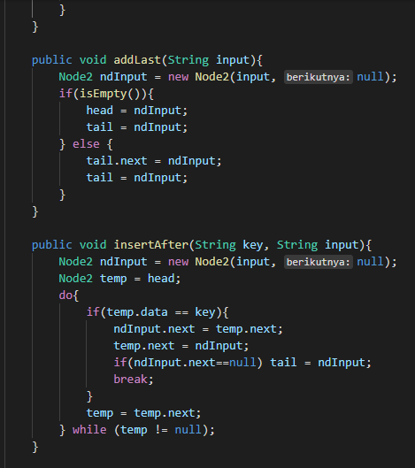

    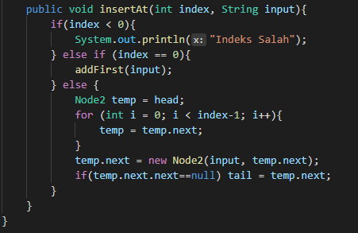

    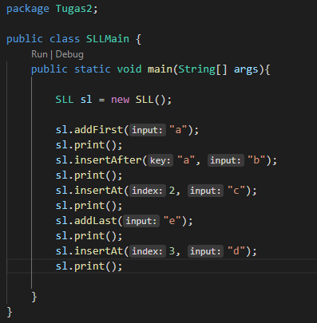

    Output :

    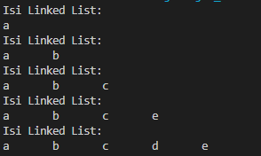

3. Stack linked list

    Kode :

    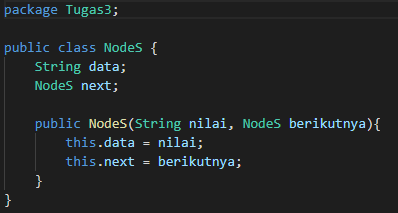

    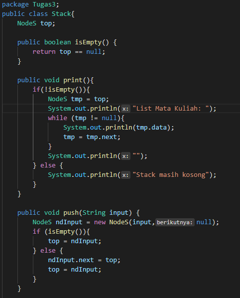

    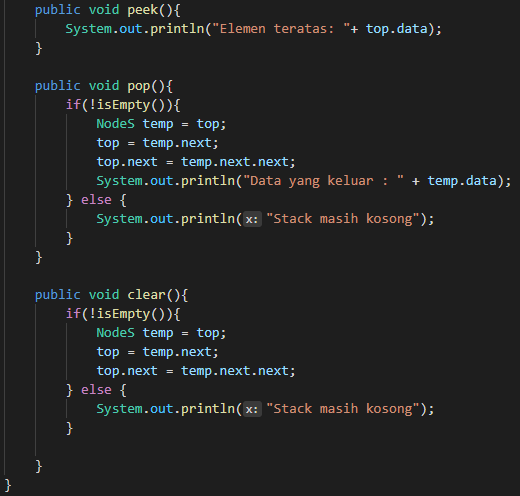

    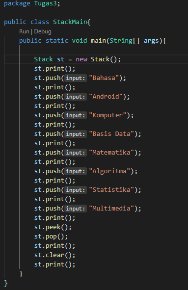

    Output :

    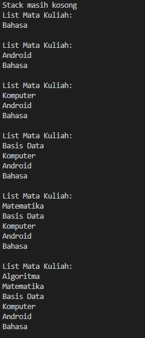

    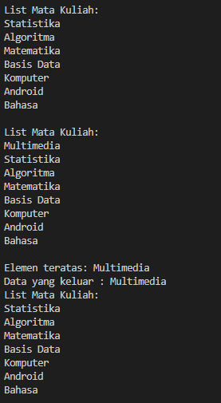

    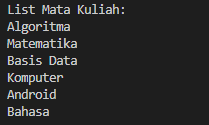

4. Queue lingked list

    Kode :

    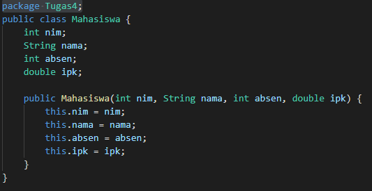

    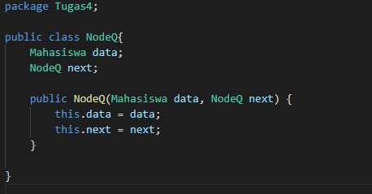

    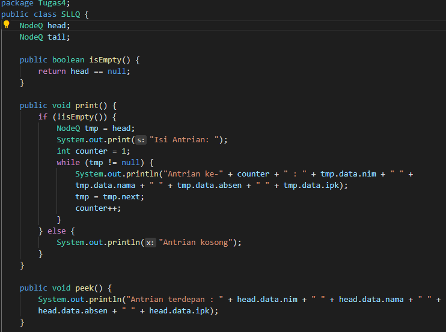

    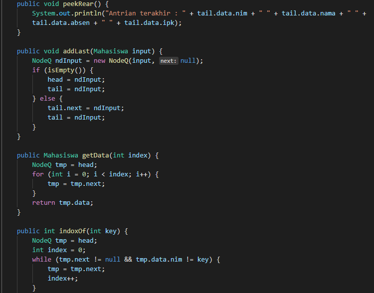

    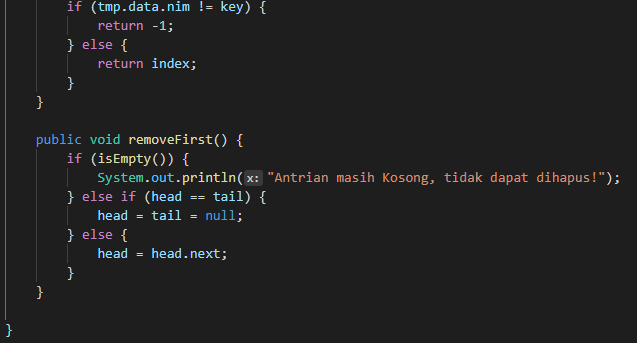

    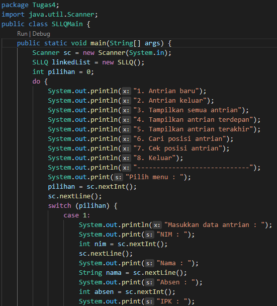

    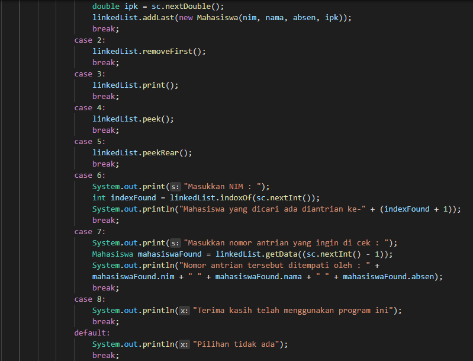

    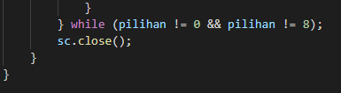

    Output :

    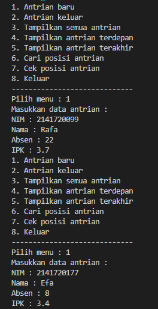

    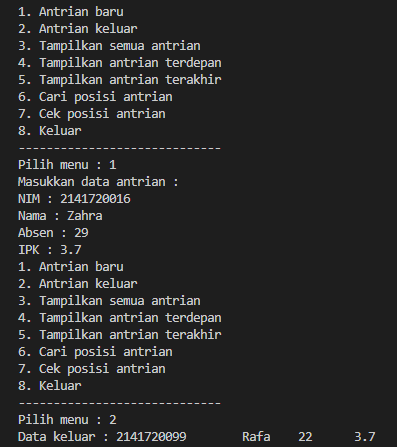

    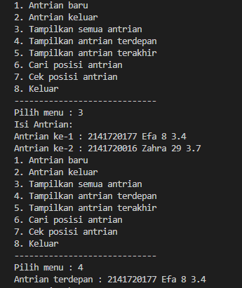

    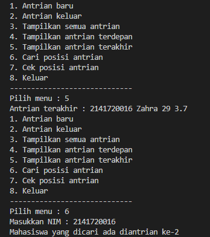

    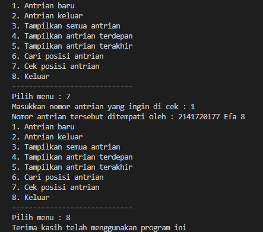