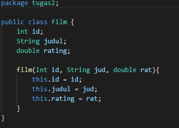
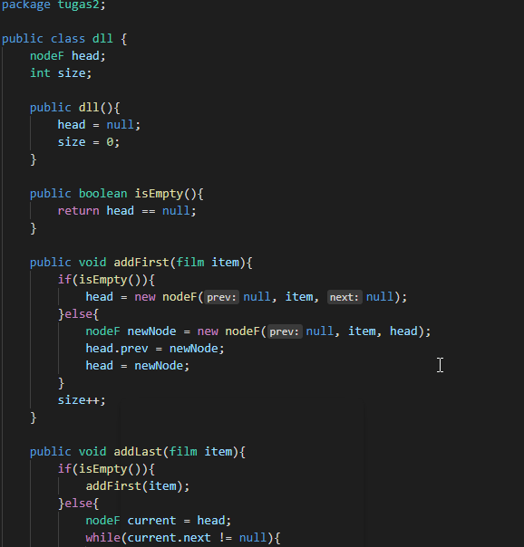

#  Laporan Praktikum Pertemuan 12

Zahra Annisa Wahono 1F-TI / 29

## Jawaban Pertanyaan

### **Praktikum 1**

1. Perbedaan single linked list dan double linked list

    **Jawab:** Perbedaannya terletak pada jumlah pointer yang dimiliki tiap node. Single linked list hanya memiliki 1 pointer yang menyimpan alamat node selanjutnya (next), sedangkan Double linked list memiliki 2 pointer yang menyimpan alamat node sebelum dan selanjutnya (prev & next)

2. Atribut next dan prev pada class Node 

    **Jawab:** digunakan sebagai pointer. Atribut next akan menyimpan alamat node selanjutnya dan atribut prev akan menyimpan alamat node sebelumnya.

3. Kegunaan inisialisasi atribut head dan size pada konstruktor class DoubleLinkedLists

    **Jawab:** Pada saat linked list baru dibuat, inisialisasi head = null dan size = 0 menandakan bahwa linked list masih dalam keadaan kosong

4. Pada method addFirst(), kenapa dalam pembuatan object dari konstruktor class Node prev dianggap sama dengan null?

    **Jawab:** Karena pada addFirst terjadi penambahan node pada bagian terdepan yang berarti node tersebut tidak memiliki alamat node sebelumnya (prev) dan hanya memiliki alamat node selanjutnya (next)

5. Pada method addFirst(). Apakah arti statement head.prev = newNode ?

    **Jawab:** Berarti prev dari head saat ini adalah node baru yang ditambahkan. Node baru yang ditambahkan berada disebelum head.

6. Perhatikan isi method addLast(), apa arti dari pembuatan object Node dengan mengisikan parameter prev dengan current, dan next dengan null?

    **Jawab:** Karena pada addFirst terjadi penambahan node pada bagian terbelakang yang berarti node tersebut tidak memiliki alamat node selanjutnya (next) karena menjadi node terakhir dan hanya memiliki alamat node sebelumnya (prev)

### **Praktikum 2**

1. Apakah maksud statement berikut pada method removeFirst()?
            head = head.next;
            head.prev = null;
        
    **Jawab:** Untuk memindahkan posisi head ke node selanjutnya dan menghapus alamat node sebelumnya pada head yang baru

2. Bagaimana cara mendeteksi posisi data ada pada bagian akhir pada method removeLast()?

    **Jawab:** Dengan melakukan perulangan hingga ditemukan node/data yang memiliki atribut next == null

3. Tidak cocok untuk perintah remove
            Node tmp = head.next;

            head.next = tmp.next;
            tmp.next.prev = head;

    **Jawab:** karena terlalu berbelit, node yang akan dihapus masih di ganti dengan nilai data next sebelum akhirnya di ganti dengan nilai head. Dan belum bisa menghubungkan prev dari tmp.next ke head

4. Fungsi kode program :
            current.prev.next = current.next;
            current.next.prev = current.prev;

    **Jawab:** Untuk mengubah alamat node yang disimpan oleh kedua node yang menghimpit node yang dihapus agar saling terhubung

### **Praktikum 3**

1. Jelaskan method size()

    **Jawab:** Untuk mereturnkan berapa banyak data yang tersimpan dalam Double Linked List

2. Jelaskan cara mengatur indeks pada double linked lists supaya dapat dimulai dari indeks ke- 1!

    **Jawab:** Sebelum menuliskan kode perulangan maka harus di deklarasikan variabel iterasi i = 1 agar penghitungan indeks mulai dari 1

3. Perbedaan karakteristik fungsi Add pada Double Linked Lists dan Single Linked Lists!

    **Jawab:** Pada Double Linked List kita harus merubah atribut next dan prev dari 2 node yang berkaitan sedangkan pada Single Linked List hanya perlu merubah atribut nextnya saja

4. Logika Kode 

    **Jawab:**

    (a) menentukan kosong tidaknya Linked List dengan mengecek size nya, jika size = 0 maka disimpulkan Linked List tersebut kosong

    (b) menentukan kosong tidaknya linked list dengan mengecek ada tidaknya head, jika head == null maka dianggap Linked List kosong

## TUGAS 1

**Kode Program**

Class NodeV

Class QDLL

Class QDLLMain

**Output**

## TUGAS 2

**Kode Program**

Class film

Class nodeF

Class dll

Class dllMain

**Output**

Menu 1, 2, dan 3

Menu 8

Menu 4

Menu 6 

Menu 9

Menu 10 

