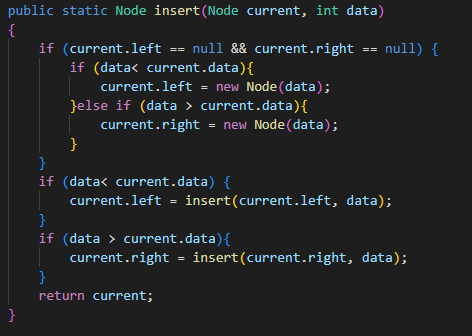
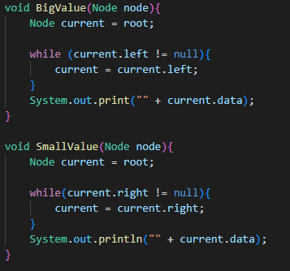
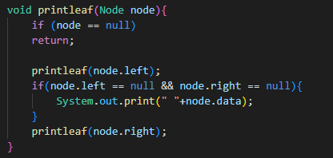
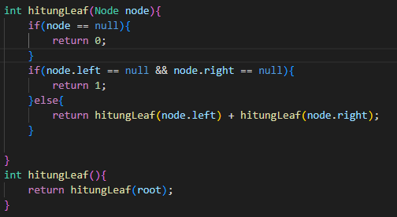
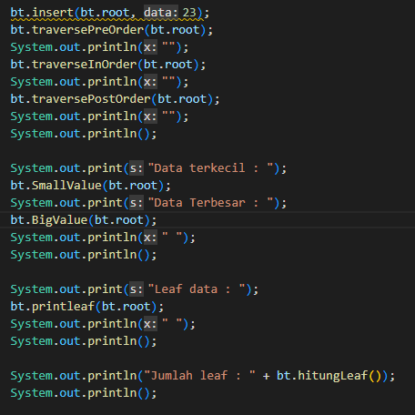
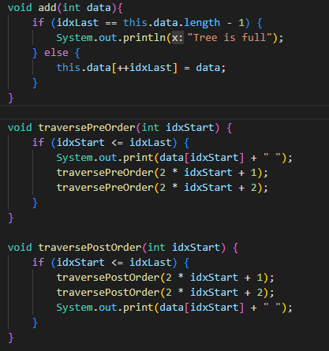
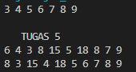

# Laporan Praktikum Pertemuan 14 

**Zahra Annisa Wahono 1F-TI/29**

## Jawaban Pertanyaan

### **Implementasi Binary Search Tree menggunakan Linked List**

1. Mengapa dalam binary search tree proses pencarian data bisa lebih efektif
dilakukan dibanding binary tree biasa?

    **Jawab:** Karena pada binary search tree data telah urut, penempatan data berdasarkan besar kecilnya data. Left child akan selalu lebih kecil dari parent dan right child akan selalu lebih besar dari parent

2. Untuk apakah di class Node, kegunaan dari atribut left dan right?

    **Jawab:** Untuk menyimpan alamat dari left child dan right child seperti halnya next dan prev linked list

3. a) Untuk apakah kegunaan dari atribut root di dalam class BinaryTree?

    **Jawab:** 
    Untuk menyimpan data yang berada pada bagian paling atas tree, seperti halnya head
    
    b) Ketika objek tree pertama kali dibuat, apakah nilai dari root?

    **Jawab:**
     Root akan bernilai null, karena belum ada data yang tersimpan dalam tree

4. Ketika tree masih kosong, dan akan ditambahkan sebuah node baru, proses apa
yang akan terjadi?

    **Jawab:** Akan terjadi proses add() atau disebut juga insert()

5. Jelaskan secara detil untuk apa baris program tersebut?

        if(data<current.data){
        if(current.left!=null){
        current = current.left;
        }else{
        current.left = new Node(data);
        break;
        }

    **Jawab:** Ketika data yang diinputkan lebih kecil data yang ditunjuk current, jika current memiliki left child maka akan terjadi pertukaran tempat dimana current akan di ganti menjadi left child (yang berarti current berjalan ke left child nya). Namun jika current tidak memiliki left child maka node baru yang berisi data yang diinputkan akan dijadikan left child dari current.

### **Implementasi binary tree dengan array**

1. Apakah kegunaan dari atribut data dan idxLast yang ada di class
BinaryTreeArray?

    **Jawab:** Untuk menyimpan indeks dimana data terakhir disimpan

2. Apakah kegunaan dari method populateData()?

    **Jawab:** Untuk menyimpan array yang berisi data dan indeks terakhir nyang terisi (size)

3. Apakah kegunaan dari method traverseInOrder()?

    **Jawab:** Untuk menelusuri tree dengan metode inOrder yaitu dengan urutan mencetak left child paling kiri kemudian parent lalu diikuti left right

4. Jika suatu node binary tree disimpan dalam array indeks 2, maka di indeks
berapakah posisi left child dan rigth child masin-masing?

    **Jawab:**  Jika dari indeks-0 maka left chilnya berada di indeks-5 dan right child berada di indeks-6. Sedangkan jika dari indeks-1 maka left child ada di indeks-4 dan right child ada di indeks-5.

5. Apa kegunaan statement int idxLast = 6 pada praktikum 2 percobaan nomor
4?

    **Jawab:** Untuk menyimpan/menandai di indeks berapa data terakhir disimpan. Pada array data, data terakhir berada di indeks ke 6.

### **Tugas**

1. Buat method di dalam class BinaryTree yang akan menambahkan node
dengan cara rekursif.

    **Kode**

    

2. Buat method di dalam class BinaryTree untuk menampilkan nilai paling kecil
dan yang paling besar yang ada di dalam tree.

    **Kode**

    

3. Buat method di dalam class BinaryTree untuk menampilkan data yang ada
di leaf.

    **Kode**

    

4. Buat method di dalam class BinaryTree untuk menampilkan berapa jumlah
leaf yang ada di dalam tree.

    **Kode**

    

    **Main 1 2 3 4**

    

    **Output 1 2 3 4**

    

5. Modifikasi class BinaryTreeArray, dan tambahkan :
• method add(int data) untuk memasukan data ke dalam tree
• method traversePreOrder() dan traversePostOrder()

    **Kode**

    

    **Main**

    

    **Output**

    
    