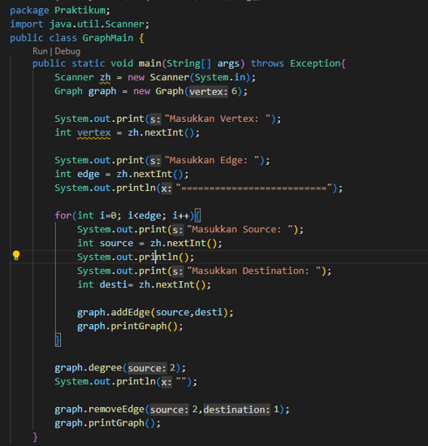
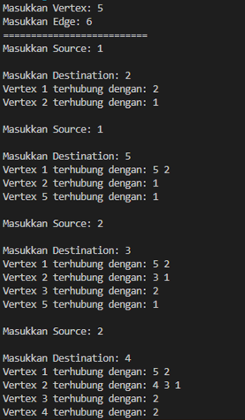
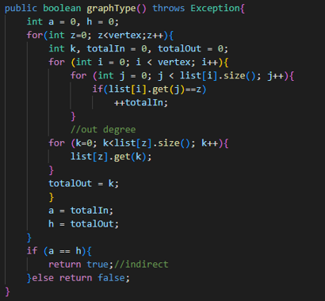
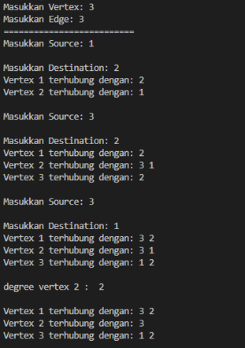
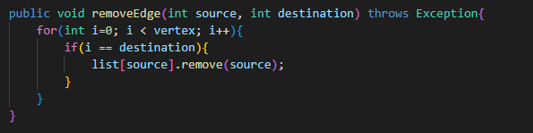
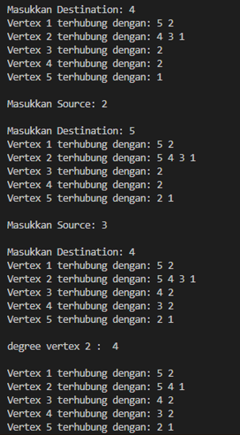
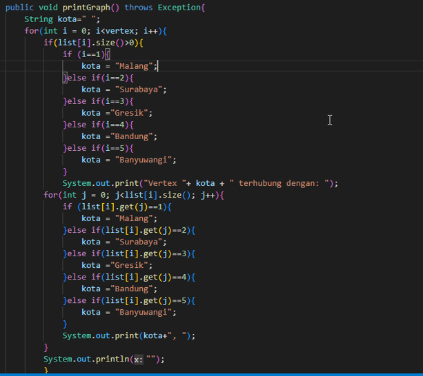
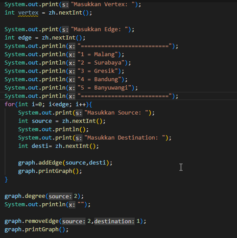
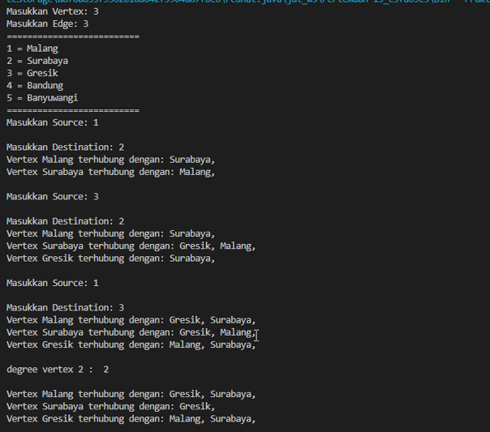

# Laporan Praktikum Pertemuan 15

**Zahra Annisa Wahono 1F-TI / 29**

## Jawaban Pertanyaan

### **Implementasi Graph menggunakan Linked List**

1. Sebutkan beberapa jenis (minimal 3) algoritma yang menggunakan dasar Graph, dan apakah
kegunaan algoritma-algoritma tersebut?

    **Jawab:** 

    a) Algoritma Warshall digunakan untuk menyelesaikan permasalahan jalur
    terpendek multi path.

    b) Algoritma Prim dan Kruskal adalah algoritma yang dapat digunakan untuk mencari pohon rentang minimum untuk graf berbobot.

    c) Algoritma Dijkstra algoritma dengan prinsip greedy yang memecahkan masalah lintasan terpendek untuk
    sebuah graf berarah dengan bobot sisi yang tidak negatif.

2. Pada class Graph terdapat array bertipe LinkedList, yaitu LinkedList list[]. Apakah tujuan
pembuatan variabel tersebut ?

    **Jawab:**
    Array tersebut akan digunakan untuk menyimpan objek berupa double linked list sebanyak vertex

3. Apakah alasan pemanggilan method addFirst() untuk menambahkan data, bukan method add
jenis lain pada linked list ketika digunakan pada method addEdge pada class Graph?
   
   **Jawab:** Karena agar nantinya indeks terurut dari yang terbaru, jika menggunakan add() maka harus menyesuaikan kembali prev dan next nya

4. Bagaimana cara mendeteksi prev pointer pada saat akan melakukan penghapusan suatu edge
pada graph ?

    **Jawab:** dengan menggunakan perulangan list[i] saat i = destination-1

5. Kenapa pada praktikum 2.1.1 langkah ke-12 untuk menghapus path yang bukan merupakan
lintasan pertama kali menghasilkan output yang salah ? Bagaimana solusinya ? 

    **Jawab:**Karena path menghapus lintasan terakhir, menggantinya dengan list[source].remove(source)

### **Implementasi Graph menggunakan Matriks**

1. Apakah perbedaan degree/derajat pada directed dan undirected graph?

    **Jawab:** Pada directed graph jumlah dari edge memiliki arah keluar dan masuk, dan jumlah edge keluar dan masuknya bisa saja berbeda. Sedangkan undirected graph memiliki jumlah edge keluar dan masuk sama.

2. Pada implementasi graph menggunakan adjacency matriks. Kenapa jumlah vertices harus
ditambahkan dengan 1 pada indeks array berikut?
            public graphArray(int v){
        vertices = v;
        twoD_array = new int [vertices + 1][vertices + 2];
    }
    
    **Jawab:** Karena pada array indeks dimulai dari 0 sedangkan graph dari 1

3. Apakah kegunaan method getEdge() ?
    
    **Jawab:** Untuk menemukan suatu edge dalam graph

4. Termasuk jenis graph apakah uji coba pada praktikum 2.2?
    
    **Jawab:** Directed graph karena 1 berhubungan dengan 2 namun 2 tidak berhubungan denga 1.

5. Mengapa pada method main harus menggunakan try-catch Exception ?
    
    **Jawab:** Agar saat terjadi error, eksekusi dapat terus berjalan tanpa memberhentikan program.

## TUGAS

1. Ubahlah lintasan pada praktikum 2.1 menjadi inputan!
 
    **Kode**

    

    **Output**

    

2. Tambahkan method graphType dengan tipe boolean yang akan membedakan graph termasuk
directed atau undirected graph. Kemudian update seluruh method yang berelasi dengan method
graphType tersebut (hanya menjalankan statement sesuai dengan jenis graph) pada praktikum
2.1

    **Kode**

    

    **Output**

    

3. Modifikasi method removeEdge() pada praktikum 2.1 agar tidak menghasilkan output yang salah
untuk path selain path pertama kali!

    **Kode**

    

    **Output**

    

4. Ubahlah tipe data vertex pada seluruh graph pada praktikum 2.1 dan 2.2 dari Integer menjadi
tipe generic agar dapat menerima semua tipe data dasar Java! Misalnya setiap vertex yang
awalnya berupa angka 0,1,2,3, dst. selanjutnya ubah menjadi suatu nama daerah seperti Gresik,
Bandung, Yogya, Malang, dst.

    **Kode**

    
    

    **Output**

    

    