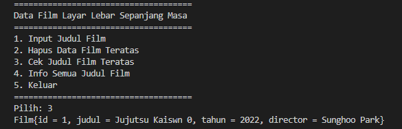

# Laporan Praktikum Pertemuan 16

**Zahra Annisa Wahono 1F-TI / 29**

## Jawaban Pertanyaan

### **Praktikum 1**

1. Perhatikan baris kode 25-36, mengapa semua jenis data bisa ditampung ke dalam sebuah Arraylist?

    **Jawab:** Karena pada instansiasi tidak dibatasi tipe data yang boleh dimasukkan, maka secara default tipe data yang digunakan adalah tipe data generic

2. Modifikasi baris kode 25-36 seingga data yang ditampung hanya satu jenis atau spesifik tipe tertentu!

    **Jawab:**

    

3. **Jawab:**

    

4. **Jawab:**

    

5. **Jawab:**

    

    Kita dapat membatasi tipe data yang akan dimasukkan dengan <*tipe data*>. Dengan menggunakan class Linkedlist kita dapat menggunakan methode linked list seperti push(), getFirst(), ataupun getLast() namun jika menggunakan class list tidak bisa

### **Praktikum 2**

1. Apakah perbedaan fungsi push() dan add() pada objek fruits?

    **Jawab:** Fungsi push() dan add() sama sama menambah kan elemen tertentu, namun push() merupakanfungsi dari interface stck sedangkan add() tidak

2. Silakan hilangkan baris 43 dan 44, apakah yang akan terjadi? Mengapa bisa demikian?

    **Jawab:** 

    

    Hasilnya print out akan kosong karena stack kosong

3. Jelaskan fungsi dari baris 46-49?

    **Jawab:** Digunakan class iterator untuk menentukan indeks dan mengaksesnya satu persatu yang kemudian di print 

4. Silakan ganti baris kode 25, Stack<String> menjadi List<String> dan apakah yang terjadi? Mengapa bisa demikian?

    **Jawab:** 

    

    Terjadi error pada pemanggulang fungsi push() dan empty() karene fungsi tersebut hanya dapat digunakan pada stack

5. Ganti elemen terakhir dari dari objek fruits menjadi “Strawberry”!

    **Jawab:**

    

    

6. Tambahkan 3 buah seperti “Mango”,”guava”, dan “avocado” kemudian dilakukan sorting!

    **Jawab:**

    

    

### **Praktikum 3**

1. Pada fungsi tambah() yang menggunakan unlimited argument itu menggunakan konsep apa? Dan kelebihannya apa?

    **Jawab:** Pada fungsi tambah() digunakan method addAll() dari collections yang dapat menambahkan element tanpa ada batas jumlah elemen yang ditambahkan

2. Pada fungsi linearSearch() di atas, silakan diganti dengan fungsi binarySearch() dari collection!

    **Jawab:** 

    

3. Tambahkan fungsi sorting baik secara ascending ataupun descending pada class tersebut!

    **Jawab:** 

    

## TUGAS PRAKTIKUM

1. **Kode**

    Class Film
    

    Class FilmMain
    
    

    **Output**

    Menu Awal dan  Tambah data (Push)
    

    Cetak Semua Data Film
    

    Cek Judul Film  Teratas
    

    Hapus Film Teratas
    

2. **Kode**

    Class Mahasiswa
    

    Class MataKuliah
    

    Class Nilai
    

    Class NilaiMahaiswaMain
    
    
    
    
    

    
    **Output**
    
    

    

    

    

    