# Laporan Praktikum Pertemuan 2

Zahra Annisa Wahono (2141720016) 1F - TI

## Jawaban Pertanyaan

### **2.2 Deklarasi Class, Atribut dan Method**
1. Karakteristik class/ objek :

    a. Memiliki atribut

    b. Dapat melakukan method

2. Kata kunci deklarasi class adalah **class**
    > class namaClass{
    >   
    >}

3. Pada class Barang terdapat 4 atribut, yaitu _namaBarang, jenisBarang, stok, dan hargaSatuan_ yang di deklarasi pada baris 13 dan 14
4. Class Barang memiliki 4 method, yaitu _tampilBarang()_ di line 16, _tambahStok()_ di line 23, _kurangiStok()_ di line 27, dan _hitungHargaTota()l_ di line 31
5. 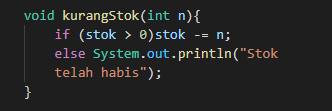
6. Method __tambahStok()_ memiliki 1 parameter int karena membutuhkan data dari luar berapa stok yang akan ditambahkan
7. Method _hitungHargaTotal()_ memiliki tipe data int karena method ini melakukan penghitungan antara *jumlah* dan *hargaSatuan* yang keduanya bertipe int dan hasil penghitungannya juga int
8. method tambahStok() memiliki tipe data void karena tidak ada output yang harus dikeluarkan dari method tersebut

### **2.3 Instansiasi Objek dan Mengakses Atribut & Method**
1. Pada class _BarangMain_, instansiasi dilakukan pada baris ke-15 dengan nama objek **b1**
2. Mengakses atribut :
    > namaObjek.namaAtribut = nilai;
    
    Contoh 
    
    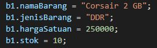 
    
   Mengakses method :
    > namaObjek.namaClass(parameter); 
    
    Contoh 
    
    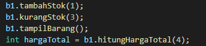

### **2.4 Membuat Konstruktor**
1. Deklarasi konstruktor ada pada baris 15 dan 25
2. Pada baris ini dilakukan instansiasi konstruktor berparameter yang berisikan "Logitech", "Wireless Mouse", 150000, dan 25
3. 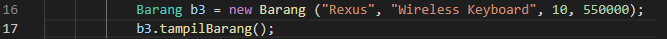

### **Latihan**
**1. Objek Barang**

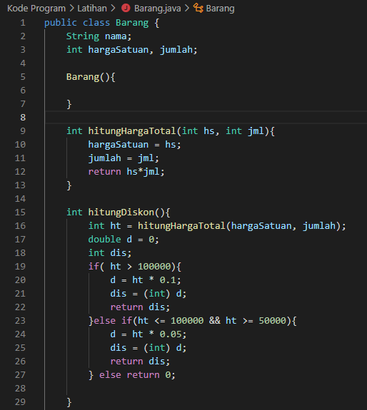
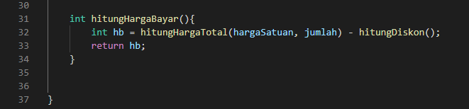
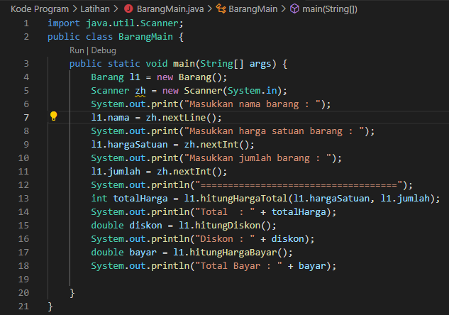

Output
        
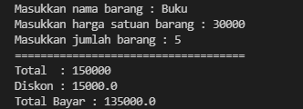

**2. Objek PacMan**

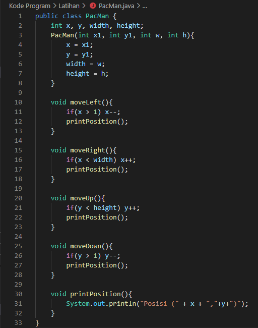
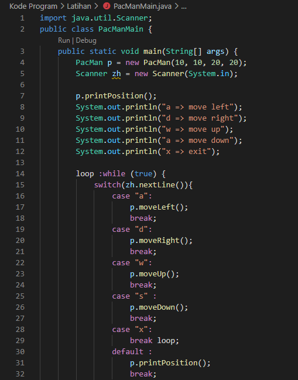
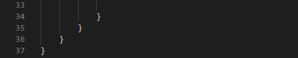

Output
        
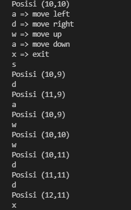