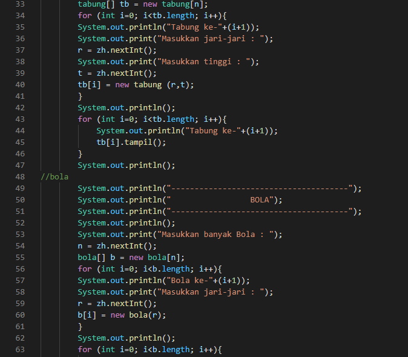

# Laporan Praktikum Pertemuan 3

Zahra Annisa Wahono (2141720016) 1F - TI

## Jawaban Pertanyaan

### **3.2 Membuat Array dari Object, Mengisi dan Menampilkan**
1. Apakah class yang akan dibuat array of object harus selalu memiliki atribut dan sekaligus method? Jelaskan! 

    **Jawab :** Class yang akan dibuat array of object harus memiliki atribut namun tidak harus memiliki method. Atribut dibutuhkan untuk menampung nilai masukan sedangkan method tidak harus ada karena program akan berjalan sesuai source code di Main program

2.  Apakah class PersegiPanjang memiliki konstruktor?Jika tidak, kenapa dilakukan pemanggilan konstruktur pada baris program berikut :

    ppArray[] = new PersegiPanjang();

    **Jawab :** Kode diatas digunakan untuk deklarasi dari array dengan indeks tertentu yang berisi objek dari class PersegiPanjang

3. Apa yang dimaksud dengan kode berikut ini:

    PersegiPanjang[] ppArray = new PersegiPanjang[3];

    **Jawab :** Kode tersebut digunakan untuk membuat array baru dari class PersegiPanjang dengan length ppArray 3

4. Apa yang dimaksud dengan kode berikut ini:

    ppArray[1] = new PersegiPanjang();
        ppArray[1].panjang = 80;
        ppArray[1].lebar = 40;

    **Jawab :** Untuk instansiasi pparray dengan indeks 1 berisi objek  dari class PersegiPanjang dengan panjang 80  dan lebar 40

5. Mengapa class main dan juga class PersegiPanjang dipisahkan pada uji coba 3.2?
    **Jawab :** Karena berbasis objek maka PersegiPanjang dibuatkan class tersediri dengan berisi atribut yang dimiliki

### **3.3 Menerima Input Isian Array Menggunakan Looping**

1. Apakah array of object dapat diimplementasikan pada array 2 Dimensi?

    **Jawab :** Ya bisa

2. Jika jawaban soal no satu iya, berikan contohnya! Jika tidak, jelaskan!
    
    **Jawab :**  
     Run    

3. Jika diketahui terdapat class Persegi yang memiliki atribut sisi bertipe integer, maka kode dibawah ini akan memunculkan error saat dijalankan. Mengapa?

    `Persegi[] pgArray = new Persegi[100];`
    
    `pgArray[5].sisi = 20`

    **Jawab :** Pada kode di atas belum mengintansiasi objek pada array pgArray[5], maka dari itu pgArray[5] masih dianggap kosong tanpa instansiasi objeknya. 
    
    Harus ditambahkan kode berikut sebelum inisisalisasi atribut agar program dapat berjalan
    
    `pgArray[5] = new Persegi();`

4. Modifikasi kode program pada praktikum 3.3 agar length array menjadi inputan dengan Scanner!

    **Jawab:** 
    

5. Apakah boleh Jika terjadi duplikasi instansiasi array of objek, misalkan saja instansiasi dilakukan pada ppArray[i] sekaligus ppArray[0]? Jelaskan !

    **Jawab:** Tidak karena instansiasi array of objects harus di lakukan satu per satu, namun intansiasi dapat menggunakan perulangan untuk mempersingkat kode program

### **3.4 Operasi Matematika Atribut Object Array**

1. Dapatkah konstruktor berjumlah lebih dalam satu kelas? Jelaskan dengan contoh!

    **Jawab:** Bisa asalkan memiliki parameter yang berbeda

    **Contoh:** 

    Namun jika jumlah dan jenis parameter sama, maka akan terjadi eror 

2. Jika diketahui terdapat class Segitiga seperti berikut ini:

    `public class Segitiga {`
    
    `public int alas;`
    
    `public int tinggi;`

    Tambahkan konstruktor pada class Segitiga tersebut yang berisi parameter int a, int t yang masing-masing digunakan untuk mengisikan atribut alas dan tinggi.

    **Jawab:** 

3. Tambahkan method hitungLuas() dan hitungKeliling() pada class Segitiga tersebut.

    **Jawab:** 

4. Pada fungsi main, buat array Segitiga sgArray yang berisi 4 elemen, isikan masing-masing atributnya sebagai berikut:

        sgArray ke-0 alas: 10, tinggi: 4

        sgArray ke-1 alas: 20, tinggi: 10

        sgArray ke-2 alas: 15, tinggi: 6

        sgArray ke-3 alas: 25, tinggi: 10

    **Jawab:** 

5. Kemudian menggunakan looping, cetak luas dan keliling dengan cara memanggil method hitungLuas() dan hitungKeliling().

    **Jawab:** 

    **Run:**
     
     

## **Latihan**

1. Buatlah program yang dapat menghitung luas permukaan dan volume beberapa bangun ruang (minimal 3, jenis bangun luas bebas). Buatlah 3 (tiga) class sesuai dengan jumlah jenis bangun ruang. Dan buat satu main class untuk membuat array of objek yang menginputkan atribut-atribut yang ada menggunakan konstruktor semua bangun ruang tersebut.
Keterangan : Buat looping untuk menginputkan masing-masing atributnya, kemudian tampilkan luas permukaan dan volume dari tiap jenis bangun ruang tersebut.
   
    **Kode Program :**  

    **Run**   

2. Sebuah perusahaan jual beli tanah membutuhkan sebuah program yang dapat memberitahu luas tanah. Program tersebut dapat menerima input jumlah tanah yang akan dihitung dan atributpanjang dan lebar masing-masing dari tanah yang diinputkan. Program dapat menampilkan luas tanah masing-masing tanah yang diinputkan tadi dan juga tanah terluas dari ketiga tanah yang ada.

    **Kode Program :**  

    **Run** 
    
     

3. Sebuah kampus membutuhkan program untuk menampilkan informasi mahasiswa berupa nama, nim, jenis kelamin dan juga IPK mahasiswa. Program dapat menerima input semua informasi tersebut, kemudian menampilkanya kembali ke user. Implementasikan program tersebut jika dimisalkan terdapat 3 data mahasiswa yang tersedia.

     **Kode Program :**  

    **Run**
    
      

