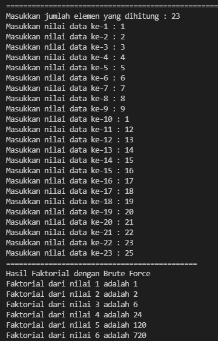
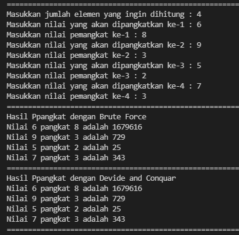
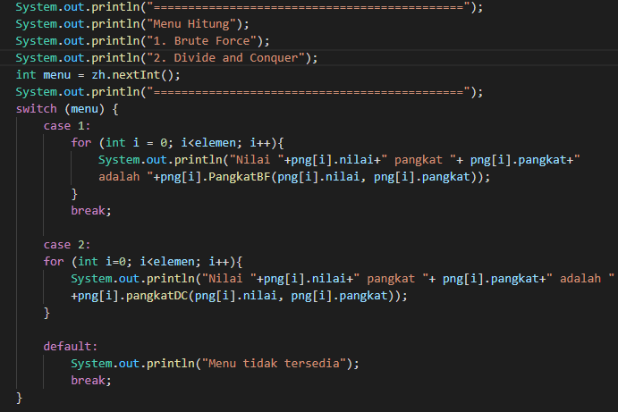
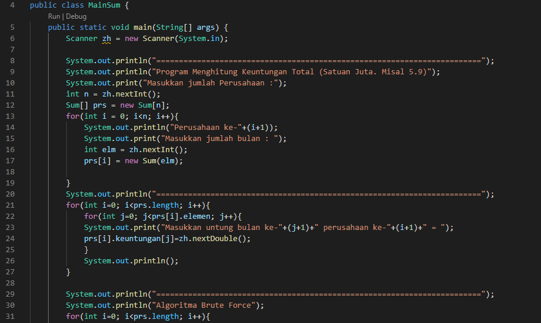

# Laporan Praktikum Pertemuan 5

Zahra Annisa Wahono (2141720016) 1F - TI

## Jawaban Pertanyaan
### **4.2 Menghitung Nilai Faktorial dengan Algoritma Brute Force dan Divide and Conquer** ###
1.  Jelaskan mengenai base line Algoritma Brute Force dan Divide and Conquer untuk melakukan pencarian nilai faktorial !
    
    **Jawab:** Base line dari pencarian faktorial pada percobaan 4.2 adalah n==1. Jadi ketika n sama dengan 1 maka akan diretunkan 1 dan akan masuk ketahap berikutnya.

2. Jelaskan 3 tahapan divide, conquer, dan combine beserta kode programnya

    **Jawaab:** 
    
    **Devide** yaitu pembagian masalah menjadi beberapa bagian yang memiliki kemiripan dengan masalah awal namun berukuran lebih kecil. Pada kode di atas terlihat terjadi pembagian masalah yang ditandai dengan adanya if-else dimana if sebagai base case sedangkan else sebagai rekursif call

    **Conquer** yaitu pemecahan masing masing bagian masalah secara rekursif. Pada kode line 23 terjadi

3. Apakah memungkinkan perulangan pada method *faktorialBF()* dirubah selain menggunakan for ? Buktikan!

    **Jawab:** Memungkinkan jika menggunakan perulangan while, sedangkan jika denga do-while tidak bisa. 
    
    **While**  
    **Do-While**  

4. Tambahkan pegecekan waktu eksekusi kedua jenis method tersebut!
    
    **Jawab:**   

5. Buktikan dengan inputan elemen yang di atas 20 angka, apakah ada perbedaan waktu eksekusi?
    
    **Jawab:** 
    
    a. Dibawah 20 angka 

    b. Diatas 20 angka  

    Terdapat perbedaan yang signifikan antara waktu eksekusi 4 angka dan eksekusi diatas 20 angka. Namun, tidak ada perbedaan antara waktu kedua algoritma. 

### **3.3 Menghitung Hasil Pangkat dengan Algoritma Brute Force dan Divide and Conquer** ###
1. Perbedaan method *PangkatBF()* dan *PangkatDC()*

    **Jawab:** Pada method *PangkatBF()* digunakan algoritma Broce Force yang ditandai dengan penggunaan iterasi ata perulangan for

2. Arti dari kode 
    **Jawab:** Itu berarti jika pangkat ganjil perhitungan akan dibagi menjadi dua, karena pangkat ganjil maka akan dikalikan bilangan itu sendiri sebanyak satu kali (karena ganjil memiliki modulus 2 sama dengan 1). Sedangkan untuk pangkat genap maka perhitungan akan dibagi menjadi dua.

3. Apakah tahap combine termasuk dalam kode tersebut?

    **Jawab:** Ya. Karena terdapat return yang merupakan hasil penggabungan dan penyelesaian dari bagian bagian masalah yang telah dipecah.

4. Modifikasi kode program tersebut, anggap proses pengisian atribut dilakukan dengan
konstruktor.

    **Jawab:** 

    **Run**  

5. Tambahkan menu agar salah satu method yang terpilih saja yang akan dijalankan!

    **Jawab:** 

    **Run**  

### **3.4 Menghitung Sum Array dengan Algoritma Brute Force dan Divide and Conquer** ###

1. Ilustrasi perbedaan perhitungan keuntungan method *TotalBF()* dan *TotalDC()*

    **Jawab:**

    **TotalBF()** menggunakan fungsi iterasi untuk melakukan penjumlahan keuntungan satu per satu hingga seluruh keutungan dijumlahkan yang kemudian menyimpannya dalam variabel total dan setelah seluruh keutungan dijumlahkan nantinya di-returnkan.

    **TotalDC()** menggunakan fungsi rekursif untuk membagi masalah menjadi 3 bagian yaitu lsum,rsum dan mid serta dengan base l==r (divide). Mid digunakan untuk memecah masalah/bagian menjadi 2 yang kemudian dipanggil fungsi rekursif untuk lsum dan rsum (conquer). Setelah itu hasil dari lsum,rsum, dan mid dijumlahkan dan kemudian direturnkan(combine).   

2. Perhatikan output dari kedua jenis algoritma tersebut bisa jadi memiliki hasil berbeda di belakang
koma. Bagaimana membatasi output di belakang koma agar menjadi standar untuk kedua jenis
algoritma tersebut.

    **Jawab:**

    **Kode**

    **Run**

3. Mengapa terdapat formulasi return value berikut?Jelaskan!
   > return lsum+rsum+mid; 

    **Jawab:** Untung menjumlahkan pecahan masalah yang telah didihitung. Mid adalah bagian tengah dari array dengan indeks [n/2]. lsum adalah hasil perhitungan dari nilai nilai yang ada pada array [0] sampai array[mid-1] atau bagian kiri dari mid. Sedangkan rsum adalah hasil perhitungan dari nilai nilai yang ada pada array [mid+1] sampai array[array.length] atau bagian kanan dari mid.

4. Kenapa dibutuhkan variable mid pada method TotalDC()?

    **Jawab:** Agar dapat membagi proses perhitungan menjadi 2 bagian yaitu lsum(kiri) dan rsum(kanan) untuk mempercepat perhitungan.

5. Program perhitungan keuntungan suatu perusahaan ini hanya untuk satu perusahaan saja. Bagaimana
cara menghitung sekaligus keuntungan beberapa bulan untuk beberapa perusahaan.(Setiap perusahaan
bisa saja memiliki jumlah bulan berbeda-beda)? Buktikan dengan program!

    **Jawab:** 

    **Kode** 

    **Run** 

### **Latihan**

**Kode**  

**Run**  
