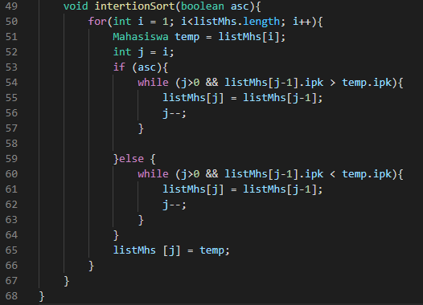
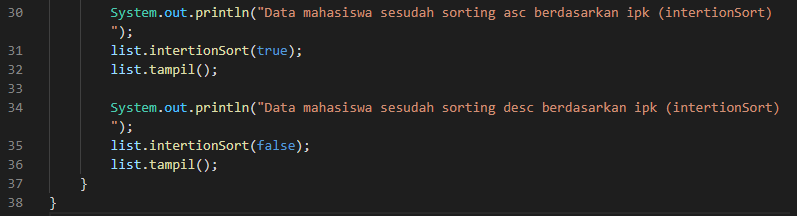
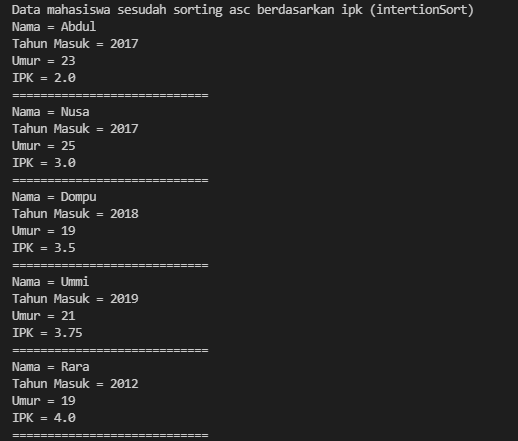
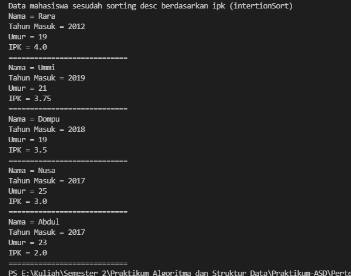
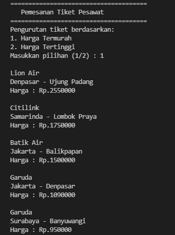
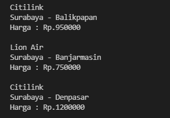

# Laporan Praktikum Pertemuan 6

Zahra Annisa Wahono 1F-TI 29/2141720016

## Jawaban Pertanyaan

### **5.2 Mengurutkan Data Mahasiswa Berdasarkan IPK Menggunakan Bubble Sort**

1. Terdapat di method apakah proses bubble sort?
 
    **Jawab:** Ada pada method bubbleSort()

2. Terdapat di method apakah proses selection sort?
    
    **Jawab:** Ada pada method selectionSort()

3. Apakah yang dimaksud swap? Tuliskan potongan program untuk melakukan proses swap tersebut!

    **Jawab:** Swap adalah proses untuk menukarkan posisi/indeks dari 2 nilai pada array
    ```
    temp = arr[1];
    arr[1] = arr[2];
    arr[2] = temp;
    ```

4.  ```
    if(listMhs[j].ipk>listMhs[j-1].ipk){
        Mahasiswa tmp = listMhs[j];
        listMhs[j] = listMhs[j-1];
        istMhs[j-1] = tmp;
    ```
    
    Untuk apa proses diatas?

    **Jawab:** Untuk menukarkan posisi nilai ipk pada listMhs[j] dan listMhs[j-1] apabila nilai ipk dari listMhs[j] lebih besar daripada listMhs[j-1]

5. ``` 
   for(int i=0; i<listMhs.length-1;i++){
    for(int j=1; j<listMhs.length-1; j++){
    ```        
    a. Apakah perbedaan antara kegunaan perulangan i dan j?

        Perulangan i digunakan untuk pengulang proses bubble sort pada seluruh array. Sedangkan perulangan j digunakan untuk mengulang tahapan pengecekan tiap 2 array (bila memenuhi if() maka akan di swap) pada tiap prosesnya

    b. Mengapa syarat dari perulangan i adalah i<listMhs.length-1?
        
        Karena proses bubble sort akan diulang dari elemen pertama hingga elemen terakhir array sebanyak array.length- 1 karena pada perulangan ke array.length elemen array telah terurut. 

    c. Mengapa syarat dari perulangan j adalah j<listMhs.length-i ?

        Karena proses pengecekan atau pembandingan akan dilakukan untuk tiap elemen dan elemen berikutnya sebanyak panjang array yang terus berkurang -1 pada tahap berikutnya (kenaikan i)

    d. Jika banyak data di dalam listMhs adalah 50, maka berapakali perulangan i akan berlangsung? Dan ada berapa Tahap bubble sort yang ditempuh?

        Perulangan i akan dilakukan sebanyak 49 kali(i=0 - i<49) dan pada tiap prosesnya memiliki tahapan sebanyak j<49-i(j mulai dari 1). Contoh pada perulangan i ke 30 maka j = 18 kali

### **5.3 Mengurutkan Data Mahasiswa Berdasarkan IPK Menggunakan Selection Sort**
```
int idxMin = i;
for(int j=i+1; j<listMhs.length; j++){
    if(listMhs[j].ipk < listMhs[idxMin].ipk){
            idxMin = j;
 ```
Untuk apakah proses tersebut, jelaskan!

    idxMin digunakan untuk menyimpan indeks array dengan nilai terkecil. Proses diatas adalah proses pemilihan atau pencarian nilai terkecil yang nantinya akan digunakan sebagai pembanding

### **5.4 Mengurutkan Data Mahasiswa Berdasarkan IPK Menggunakan Insertion Sort**

Ubahlah fungsi pada InsertionSort sehingga fungsi ini dapat melaksanakan proses sorting dengan cara ascending atau decending, anda dapat melakukannya dengan menambahkan parameter pada pemanggilan fungsi insertionSort.

 

    
## Latihan
Output :




  
    