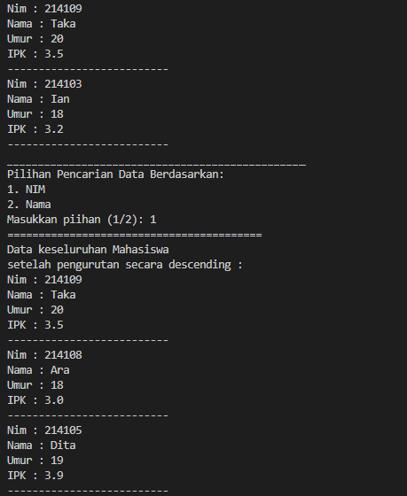

# Laporan Prakatikum Pertemuan 7

Zahra Annisa Wahono 1F-TI/29

## Jawaban Pertanyaan

### **6.2. Searching / Pencarian Menggunakan Algoritma Sequential Search**

1. Jelaskan perbedaan metod TampilData dan Tampilposisi pada class PencarianMhs

    **Jawab:** method TampilPosisi digunakan untuk mengetahui data yang dicari ditemukan atau tidak dan di indeks mana data ditemukan. Sedangkan method TampilData digunakan untuk menampilkan seluruh data yang dimiliki objek dari Nim yang ditemukan

2. Jelaskan fungsi break pada kode program dibawah ini!

                if(listMhs[j].nim==cari){
                posisi = j;
                break;
            }
    **Jawab:** Digunakan untuk keluar dari perulangan ketika Nim yang dicari telah ditemukan

3. Jika Data Nim yang dimasukkan tidak terurut dari kecil ke besar. Apakah program masih dapat berjalan? Apakah hasil yang dikeluarkan benar? Mengapa demikian!

    **Jawab:** Hasil yang dikeluarkan akan tetap benar karena Algoritma Sequential Search akan mengecek pada tiap indeks dari indeks pertama hingga terakhir

### **6.3 Searching / Pencarian Menggunakan Binary Search**

1. Tunjukkan pada kode program yang mana proses divide dijalankan!

    **Jawab:**
    
        int mid;
        if(right >= left){
            mid = (left+right)/2;
            if(cari == listMhs[mid].nim){

     Kode diatas digunakan pada proses divide yaitu dengan membagi array menjadi 3 bagian yaitu left, mid, dan right

2. Tunjukkan pada kode program yang mana proses conquer dijalankan!

    **Jawab:** 

        }else if (listMhs[mid].nim > cari){
            return FindBinarySearch(cari, left, mid -1);
        }else {
             return FindBinarySearch(cari, mid+1, right);
        }

    Kode diatas digunakan pada proses conquer yaitu dengan membagi bagian bagian menjadi subarray dengan menggunakan fungsi rekursif

3. Jika data Nim yang dimasukkan tidak urut. Apakah program masih dapat berjalan? Mengapa demikian!
    
    **Jawab:** Tidak karena algoritma pencarian ini sangat bergantung pada perbandingan nilai pada tiap indeknya

    Kode: 

        if(right >= left){

    dan

        }else if (listMhs[mid].nim > cari){
 

4. Jika Nim yang dimasukkan dari NIM terbesar ke terkecil (missal : 20215, 20214, 20212, 20211, 20210) dan elemen yang dicari adalah 20210. Bagaimana hasil dari binary search? Apakah sesuai? Jika tidak sesuai maka ubahlah kode program binary seach agar hasilnya sesuai

    **Jawab:** Hasil tidak ditemukan

    

    **Setelah Modifikasi Descending**
    
    Kode

    

    Output

    

    

5. Modifikasilah program diatas yang mana jumlah mahasiswa yang di inputkan sesuai dengan masukan dari keyboard.

    **Jawab:**

    Kode yang dimodifikasi :

    

    

    Output :

    

    

## Latihan Praktikum

1. Modifikasi percobaan searching diatas dengan ketentuan berikut ini
    - Sebelum dilakukan searching dengan binary search data harus dilakukan pengurutan dengan menggunakan algoritma sorting (pilih salah satu algoritma sorting dari pertemuan sebelumnya)
    
    **Jawab:**

    Kode modifikasi :

    

    

    Output : 

    

    

    

2. Modifikasi percobaan searching diatas dengan ketentuan berikut ini
    - Pencarian dilakukan berdasarkan Nama Mahasiswa (gunakan Algoritma Sequential Search)
    - Jika terdapat nama yang sama? Bagaimana keluaran dari kode program ketika pencarian dilakukan pada nama yang sama!

    **Jawab:**

    Kode modifikasi :

    >class PencarianMhs
    

    >class MahasiswaMain
    

    Output : 

    

    

3. Buatlah program untuk mengurutkan array tersebut (boleh memilih metode pengurutan) selanjutnya lakukan pencarian dan mencetak isi array yang nilainya terbesar, dan mencetak ada berapa buah nilai terbesar tersebut serta berada dilokasi mana saja nilai terbesar tersebut! (menggunakan binary search)

    **Jawab:**

    Kode :
      
    

    Output :
    

