# Laporan Praktikum Pertemuan 9

Zahra Annisa Wahono 1F-TI / 29

## Jawaban Pertanyaan

### **Praktikum 1** 
1. Berapa banyak data pakaian yang dapat ditampung di dalam stack? Tunjukkan potongan kode program untuk mendukung jawaban Anda tersebut!

    **Jawab:** Jumlah pakaian yang dapat ditampung adalah 5

    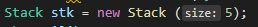

2. Perhatikan class StackMain, pada saat memanggil fungsi push, parameter yang dikirimkan adalah p. Data apa yang tersimpan pada variabel p tersebut?

    **Jawab:** p adalah objek dari class pakaian yang telah diisikan nilai atributnya jadi p memiliki atribut jenis, warna, merk, ukuran, dan harga

3. Apakah fungsi penggunaan do-while yang terdapat pada class StackMain?

    **Jawab:** Untuk mengisikan atribut dari objek dan mengintansiasi objek pakaian baru. Jika user ingin menambahkan objek lagi, maka perulangan akan terjadi.

4. Modifikasi kode program pada class StackMain sehingga pengguna dapat memilih operasi-operasi pada stack (push, pop, peek, atau print) melalui pilihan menu program dengan memanfaatkan kondisi IF-ELSE atau SWITCH-CASE!

    **Jawab:** 

    Kode
    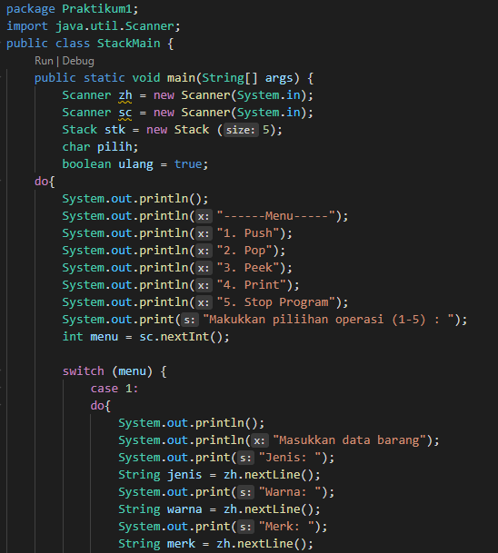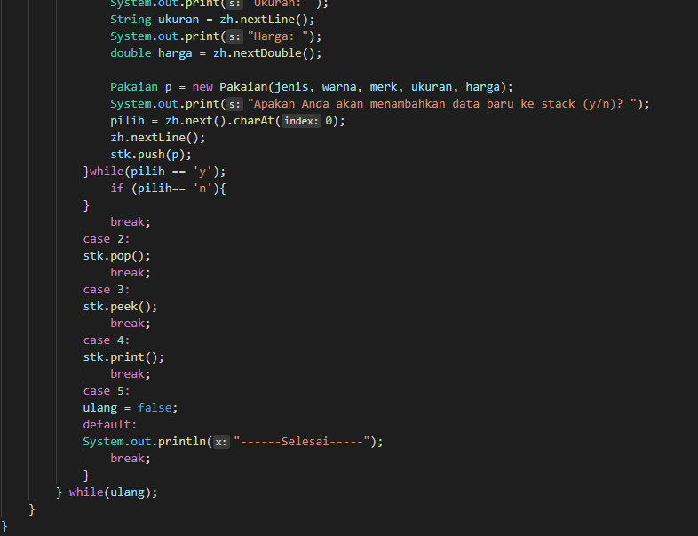
    
    Output
    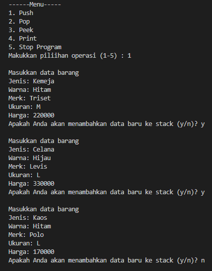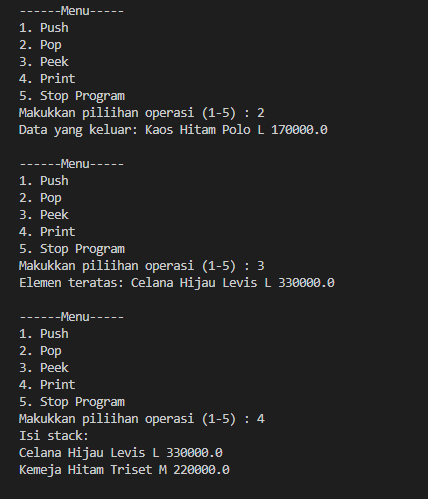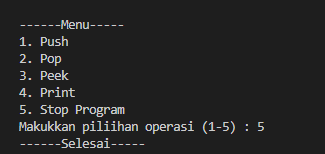

### **Praktikum 2**

1. Perhatikan class Postfix, jelaskan alur kerja method derajat!

    **Jawab:** Jika c = ^ (simbol pangkat) maka nilai derajat yang dimiliki adalah 3. Jika c = % atau / atau * (modulus, pembagian, perkalian) maka nilai derajat adalah 2. Jika c = - atau+ (pengurangan, penjumlahan) maka nilai derajatnya adalah 1. Sedangkan selain simbol-simbol diatas (non operator) maka memiliki derajat 0

2. Apa fungsi kode program berikut?
        c = Q.charAt(i);   

    **Jawab:** Untuk mengecek tiap tiap karakter dari Q. Mulai karakter pertama hingga terakhir

3. Jalankan kembali program tersebut, masukkan ekspresi 3*5^(8-6)%3. Tampilkan hasilnya!

    **Jawab:** 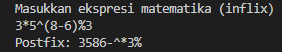

4. Pada soal nomor 3, mengapa tanda kurung tidak ditampilkan pada hasil konversi? Jelaskan!

    **Jawab:** Karena setelah tutup kurung terdeteksi, maka - akan dimasukkan ke P dan ( akan dikeluarkan kari stack

## Latihan
1. Perhatikan dan gunakan kembali kode program pada Praktikum 1. Tambahkan method getMin pada class Stack yang digunakan untuk mencari dan menampilkan data pakaian dengan harga terendah dari semua data pakaian yang tersimpan di dalam stack!

    **Jawab:** 

    Modifikasi kode
    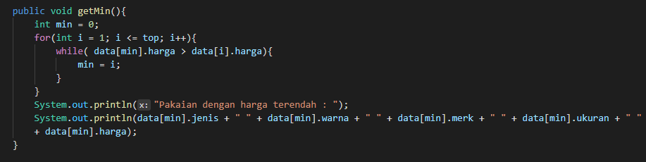

    Output
    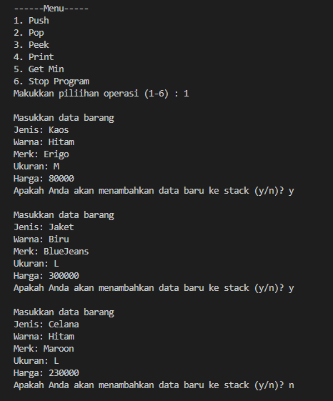 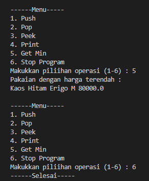

2. Program Struk

    **Jawab:**

    Kode
    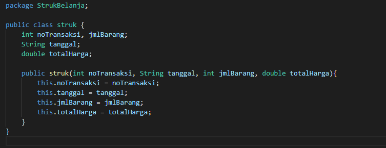 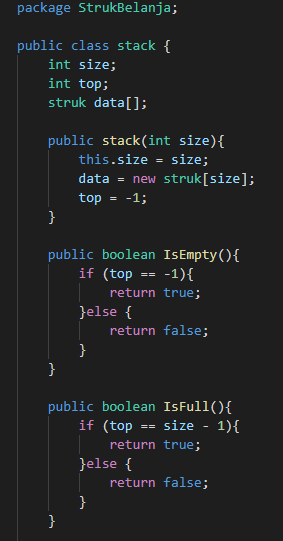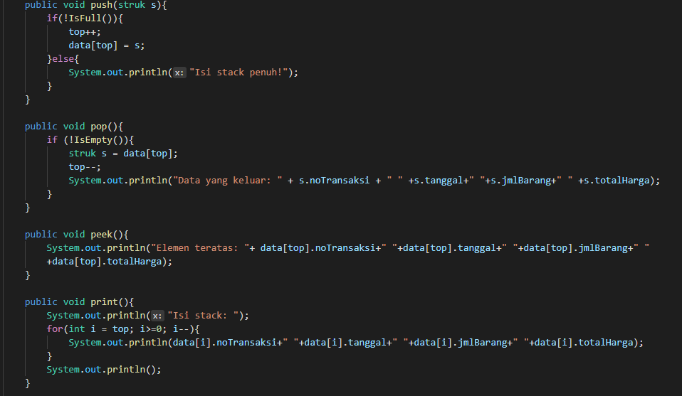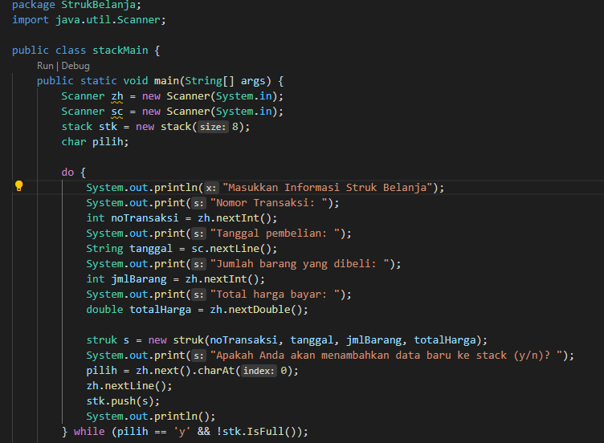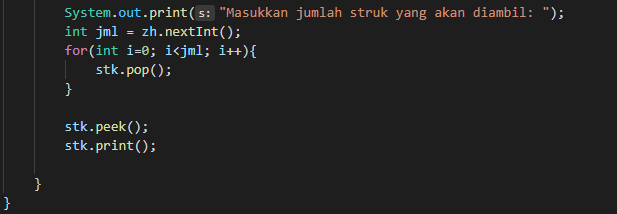

    Output
    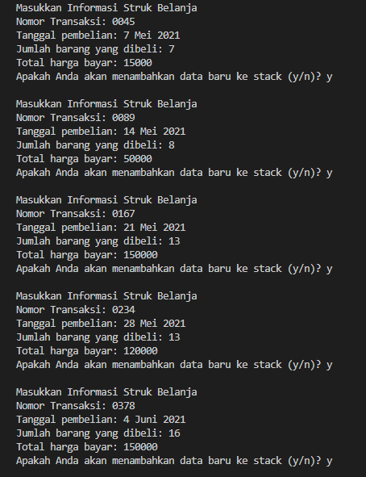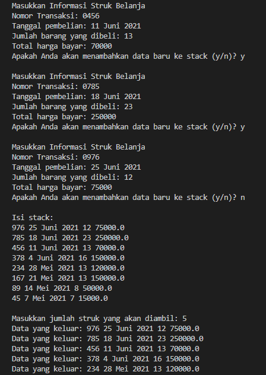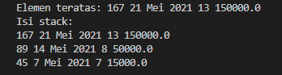